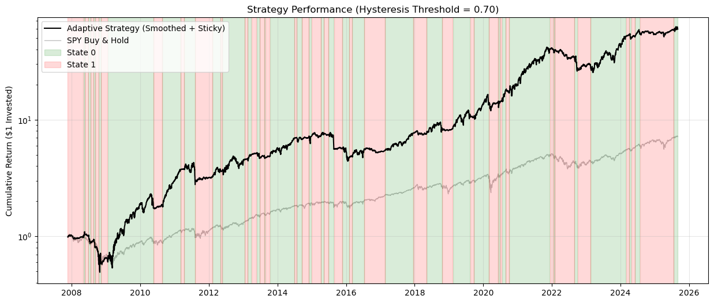

# Volatility Regime-Switching ETF Portfolio Optimization using Hidden Markov Models 

Market regime detection using Hidden Markov Models (HMM) applied to a universe of ETFs, with walk-forward portfolio optimization conditioned on the detected regime. Benchmarked against SPY over 20+ years (2002–2025).

## Overview

Markets alternate between distinct regimes — low volatility (risk-on) and high volatility (risk-off). This project uses a Gaussian HMM to detect these regimes in real time from a high-dimensional feature matrix built from 10 ETFs, then allocates across the universe using regime-conditioned portfolio optimization.

The key design principle is **strict temporal separation** — the model is only ever trained on past data and never sees future information. All results are walk-forward out-of-sample.

---

## Notebook

[`ETF_HMM_Regime.ipynb`](ETF_HMM_Regime.ipynb) [](https://colab.research.google.com/github/suryasridhar/regime-detection-and-optimization/blob/feature%2Fhmm/ETF_HMM_Regime.ipynb)

---
## Performance



---
## Results


*Rolling 1-year Sharpe, returns, and alpha vs SPY benchmark. Strategy consistently generates positive alpha except around 2015–2016 and 2024.*

### Full Period (2002–2025)

| Metric | Strategy | SPY |
|---|---|---|
| CAGR (%) | 26.45 | 12.07 |
| Ann. Volatility (%) | 30.65 | 20.06 |
| Sharpe | 0.77 | 0.57 |
| Sortino | 0.90 | 0.68 |
| Max Drawdown (%) | -55.01 | -49.32 |
| Calmar | 0.48 | 0.24 |
| Beta | 1.09 | 1.00 |
| Alpha (%) | +11.06 | 0.00 |
| Win Rate (%) | 63.77 | — |

### Post-GFC Period (2009–2025)

| Metric | Strategy | SPY |
|---|---|---|
| CAGR (%) | 31.71 | 15.25 |
| Ann. Volatility (%) | 29.08 | 18.01 |
| Sharpe | 0.95 | 0.79 |
| Sortino | 1.14 | 0.96 |
| Max Drawdown (%) | -43.33 | -30.60 |
| Calmar | 0.73 | 0.50 |
| Beta | 1.16 | 1.00 |
| Alpha (%) | +11.01 | 0.00 |
| Win Rate (%) | 61.54 | — |

### Regime Statistics

| Metric | Value |
|---|---|
| Days in Low Vol Regime (%) | 58.11 |
| Days in High Vol Regime (%) | 41.89 |
| Total Regime Switches | 63 |

---

## Universe

| Ticker | Description | Role |
|---|---|---|
| SPY | S&P 500 | Market benchmark |
| QQQ | Nasdaq 100 | Growth |
| XLK | Tech Sector | Growth |
| XLE | Energy Sector | Inflation / Value |
| XLV | Healthcare | Defensive |
| XLP | Consumer Staples | Defensive |
| TLT | 20+ Year Treasury | Crisis hedge |
| IEF | 7-10 Year Treasury | Intermediate safety |
| LQD | Investment Grade Corp Bond | Credit risk |
| NEM | Newmont Mining (Gold proxy) | Inflation hedge |

Data: September 2002 – December 2025 via `yfinance`.

---

## Pipeline

```
OHLCV data (10 ETFs, 2002–2025)
    ↓
Feature Engineering (6 features × 10 ETFs = 60 dimensions)
    ↓
Rolling Normalization (252-day) + EMA Smoothing (21-day)
    ↓
PCA (4 components)
    ↓
Gaussian HMM (2 states) — walk-forward, trained on past only
    ↓
Regime Detection with Hysteresis (threshold = 0.9)
    ↓
Regime-Conditioned Portfolio Optimization (quarterly rebalance)
    ↓
Walk-Forward Backtest vs SPY Benchmark
```

---

## Feature Matrix

| Feature | Window | Description |
|---|---|---|
| Yang-Zhang Volatility | 14-day | Overnight gap + intraday vol, Rogers-Satchell correction |
| Rolling Skewness | 63-day | Crash risk (negative skew = left tail) |
| Rolling Kurtosis | 63-day | Fat tails / fragility |
| Momentum | 14-day | Price return |
| RSI | 14-day | Relative strength |
| Money Flow Index | 14-day | Volume-weighted RSI |

Applied to all 10 ETFs → 60-dimensional feature matrix, reduced via PCA before HMM fitting.

---

## Regime Detection

- **2 HMM states:** Low Vol (Regime 0) and High Vol (Regime 1)
- **State alignment:** States sorted by mean volatility at each refit — Regime 0 always means low volatility regardless of HMM label permutation
- **Hysteresis:** Regime switch only occurs when posterior probability exceeds 0.9 — prevents rapid switching on ambiguous signals
- **Walk-forward:** HMM retrained every 63 trading days (quarterly) using all available past data

---

## Walk-Forward Setup

| Parameter | Value |
|---|---|
| Burn-in period | 1000 days (~4 years) |
| Rebalance frequency | 63 days (quarterly) |
| PCA components | 4 |
| HMM states | 2 |
| Hysteresis threshold | 0.9 |
| Benchmark | SPY |

---

## Key Findings

- **+11% annualized alpha** consistent across full period and post-GFC window
- **63-64% quarterly win rate** vs SPY — beats benchmark on 2 out of 3 quarters
- **Higher volatility and deeper drawdowns** — beta > 1 means the strategy concentrates into growth assets during low-vol regimes, amplifying both upside and downside
- **Alpha is not uniformly distributed** — strongest 2009–2011 and 2018–2022, weaker around 2015–2016 and 2024

---

## Dependencies

```
yfinance
pandas
numpy
matplotlib
seaborn
hmmlearn
scikit-learn
scipy
```

---

## References

- Hamilton, J.D. (1989). *A new approach to the economic analysis of nonstationary time series.* Econometrica.
- Yang, D. & Zhang, Q. (2000). *Drift-independent volatility estimation based on high, low, open, and close prices.* Journal of Business.
- Rogers, L.C.G. & Satchell, S.E. (1991). *Estimating variance from high, low and closing prices.* Annals of Applied Probability.